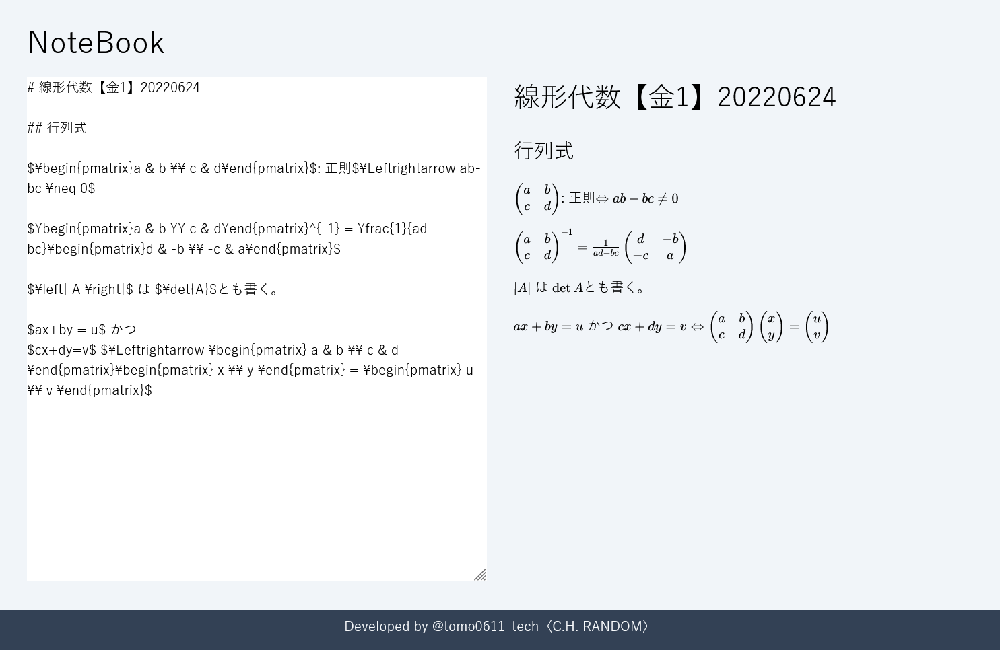

# Notebook-UI
ノートブックシステム (フロントエンド)

授業ノートや発表用ノートを作成、管理、公開するためのWebアプリケーションのUIサイドです。
数式などの記入が難しいものもインストール無しでTeX記法で表示できます。

## 機能
### 授業ノートや発表用ノートを作成、管理、公開

- [x] ノートの作成&編集
- [ ] ノートの管理
- [ ] ノートの公開
- [ ] ノートの同時共同編集

## スクリーンショット



## Getting Started

開発サーバーを実行する:

```bash
npm run dev
```

[http://localhost:3000](http://localhost:3000) をブラウザで開く。

## 利用ライブラリ
- [markdown-it-texmath](https://github.com/goessner/markdown-it-texmath): MarkdownとTeXのレンダラー